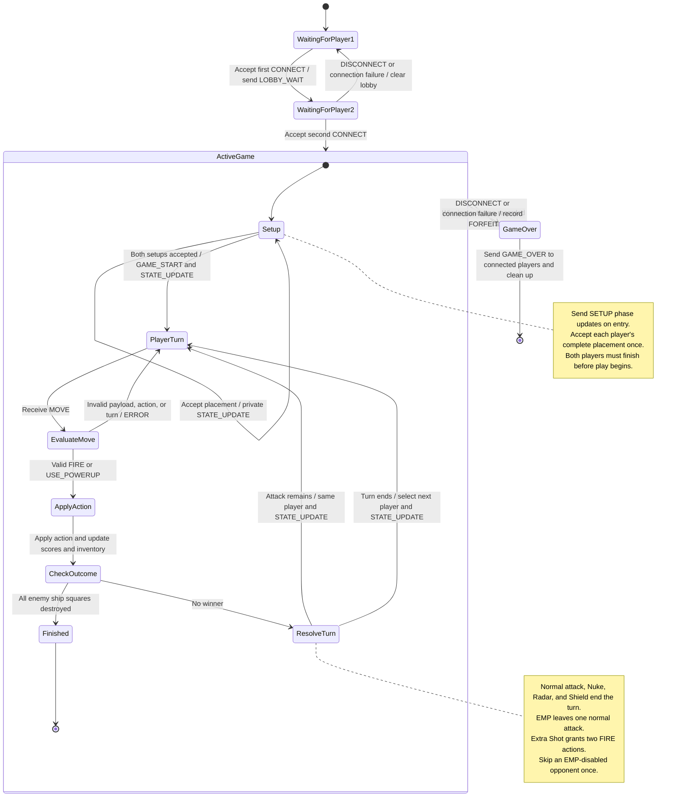

# Server-Side Game Finite State Machine

The server manages player connections, validates moves, updates the game,
and determines the outcome. The server is the authority on whose turn it
is and whether a move is valid.

## State Diagram

## Move Handling

1. During setup, accept PLACE_SHIPS only from a player whose setup
   has not yet been accepted. Reject invalid placements with ERROR.
2. Begin gameplay only after both setups are accepted.
3. During gameplay, validate the message, socket identity, active
   turn, and action against protocol_blueprint.md and the README.
4. Invalid actions return ERROR without changing game state or turn.
5. Apply valid actions and update the board, scores, and inventory.
6. If all enemy ship squares are destroyed, record the winner,
   send the final STATE_UPDATE, and send GAME_OVER.
7. Otherwise, resolve remaining attacks and EMP turn skipping,
   then send STATE_UPDATE identifying who acts next.

## Orderly Disconnects

An orderly disconnect occurs when a player sends DISCONNECT before
closing their connection.

- If Player 1 disconnects while waiting for Player 2, the server clears
  the lobby and returns to WaitingForPlayer1.
- If either player disconnects during an unfinished active game, that
  player forfeits. The server sends GAME_OVER to the remaining player
  with the outcome FORFEIT and identifies the remaining player as the winner.

## Abrupt Disconnects

An abrupt disconnect occurs when a connection closes unexpectedly,
fails, or exceeds the configured connection-liveness timeout.

- If Player 1 loses their connection while waiting for Player 2, the
  server clears the lobby and returns to WaitingForPlayer1.
- If either player loses their connection during an unfinished active
  game, the server treats the departure as a forfeit and sends GAME_OVER
  to the remaining player.
- Connection loss is a server-detected event, not a message that the
  disconnected player must send.
- If neither player remains connected, the server cleans up the match
  without attempting to deliver results to them.

## Server Event Handling

The server processes each match's events in order. Applying a valid move
and checking its outcome happen together before processing another event.
This prevents a disconnect from interrupting a partially applied move.

The disconnect transitions on ActiveGame apply to all states inside it.
Once a final outcome is recorded, later disconnects do not change it.

## Socket Termination Detection and Cleanup

- If recv() returns b"", the server has reached EOF: the peer has
  closed its sending side. The server exits the receive loop and
  triggers disconnect handling instead of repeatedly calling recv().

- Catch socket OSError failures, including connection resets and
  broken pipes, and trigger disconnect cleanup. TCP keepalive failure
  follows the blueprint's Connection-Liveness Rule. A short receive
  timeout used for checking timers alone does not trigger a forfeit.

- A network drop may not produce an immediate error. The server uses
  its configured connection-liveness timeout to detect an unresponsive
  connection.

- Disconnect handling closes the affected socket, clears its receive
  buffer, and releases the player's connection resources.

- Cleanup runs only once per connection. Repeated EOF notifications,
  errors, or timeouts do not create additional forfeits or change an
  outcome that has already been recorded.