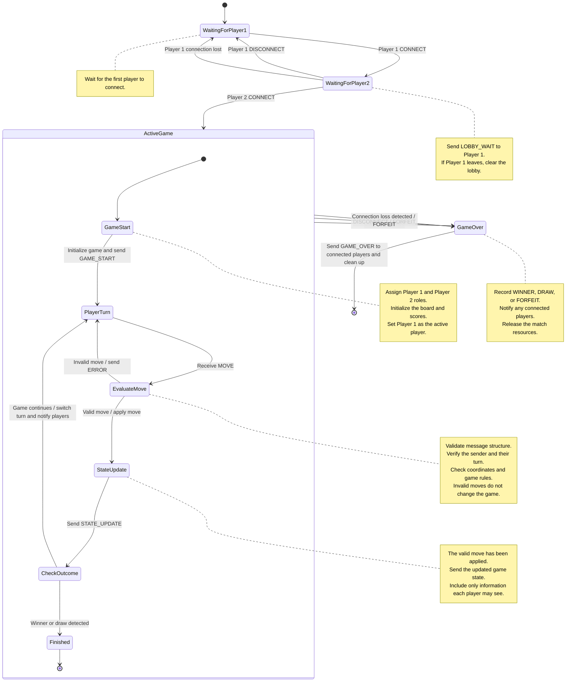

# Server-Side Game Finite State Machine

The server manages player connections, validates moves, updates the game,
and determines the outcome. The server is the authority on whose turn it
is and whether a move is valid.

## State Diagram

## Move Handling

1. The server receives a MOVE message.
2. The server validates the message, verifies that the sender is the
   active player, and checks that the move follows the game rules.
3. If the move is invalid, the server sends ERROR to the sender.
   The board and active player remain unchanged.
4. If the move is valid, the server applies it to the board, updates
   any affected scores, and sends STATE_UPDATE.
5. The server checks the updated board for a winner or draw.
6. If the game continues, the server switches the active player and
   sends STATE_UPDATE identifying whose turn is next.
7. If the game is finished, the server sends GAME_OVER.

## Orderly Disconnects

An orderly disconnect occurs when a player sends DISCONNECT before
closing their connection.

- If Player 1 disconnects while waiting for Player 2, the server clears
  the lobby and returns to WaitingForPlayer1.
- If either player disconnects during an unfinished active game, that
  player forfeits. The server sends GAME_OVER to the remaining player
  with the outcome FORFEIT and identifies the remaining player as the winner.

## Abrupt Disconnects

An abrupt disconnect occurs when a connection closes unexpectedly,
fails, or exceeds the configured connection-liveness timeout.

- If Player 1 loses their connection while waiting for Player 2, the
  server clears the lobby and returns to WaitingForPlayer1.
- If either player loses their connection during an unfinished active
  game, the server treats the departure as a forfeit and sends GAME_OVER
  to the remaining player.
- Connection loss is a server-detected event, not a message that the
  disconnected player must send.
- If neither player remains connected, the server cleans up the match
  without attempting to deliver results to them.

## Server Event Handling

The server processes each match's events in order. Applying a valid move
and checking its outcome happen together before processing another event.
This prevents a disconnect from interrupting a partially applied move.

The disconnect transitions on ActiveGame apply to all states inside it.
Once a final outcome is recorded, later disconnects do not change it.