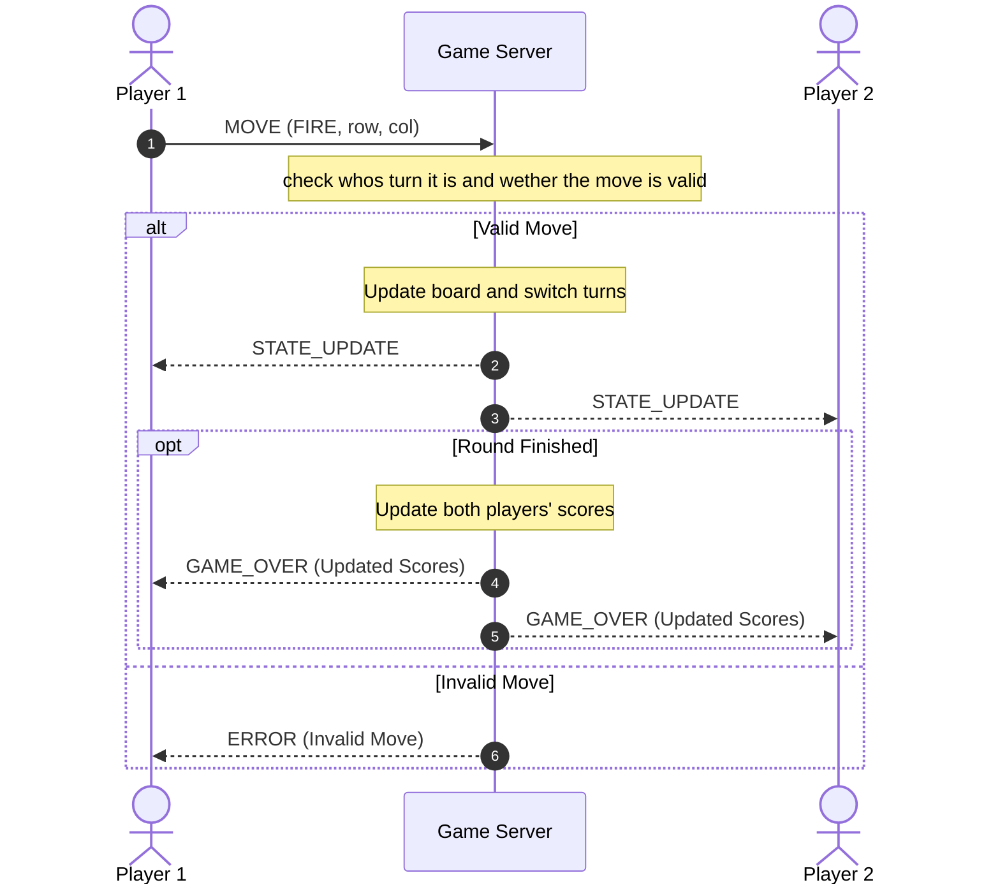

```mermaid
sequenceDiagram
    autonumber
    actor P1 as Player 1
    participant S as Game Server
    actor P2 as Player 2
    P1->>S: MOVE (FIRE, row, col)
    Note over S: check whos turn it is and wether the move is valid

    alt Valid Move
    Note over S: Update board and switch turns
    S-->>P1: STATE_UPDATE
    S-->>P2: STATE_UPDATE 
    opt Round Finished
    Note over S: Update both players' scores
    S-->>P1: GAME_OVER (Updated Scores)
    S-->>P2: GAME_OVER (Updated Scores)
    end
    else Invalid Move
    S-->>P1: ERROR (Invalid Move)
    end

```